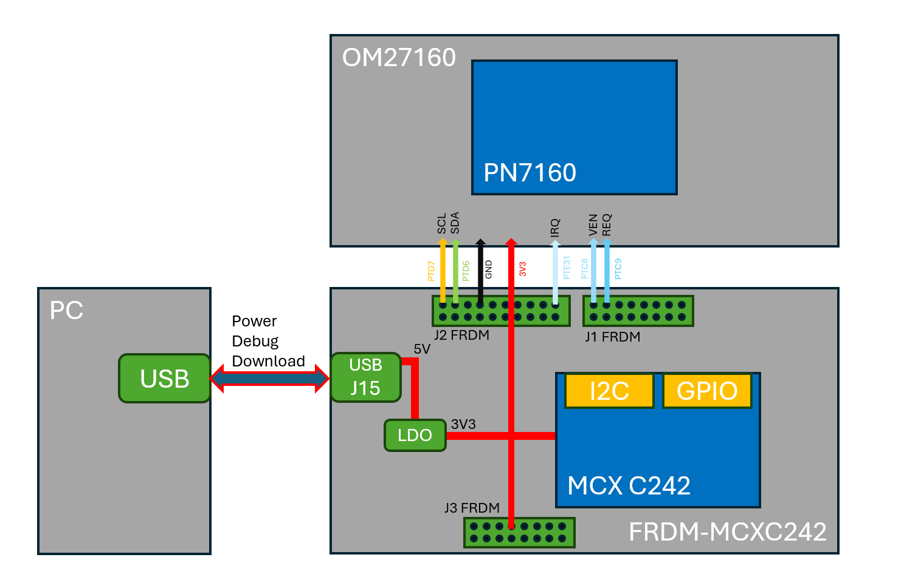
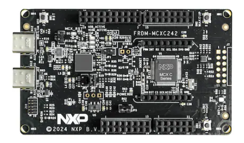
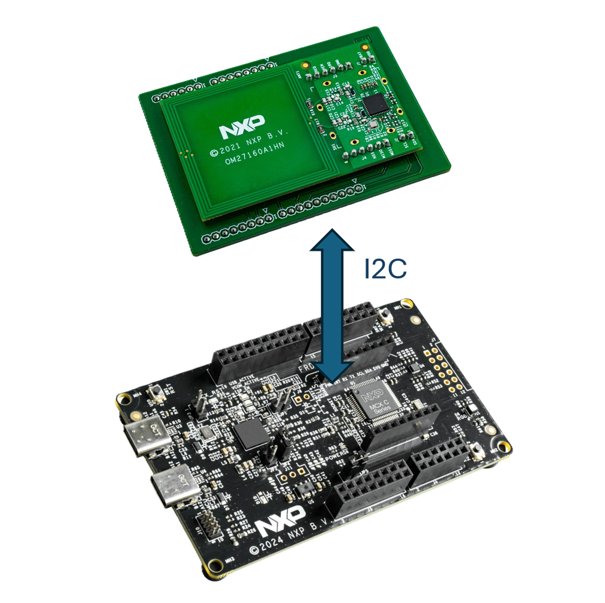
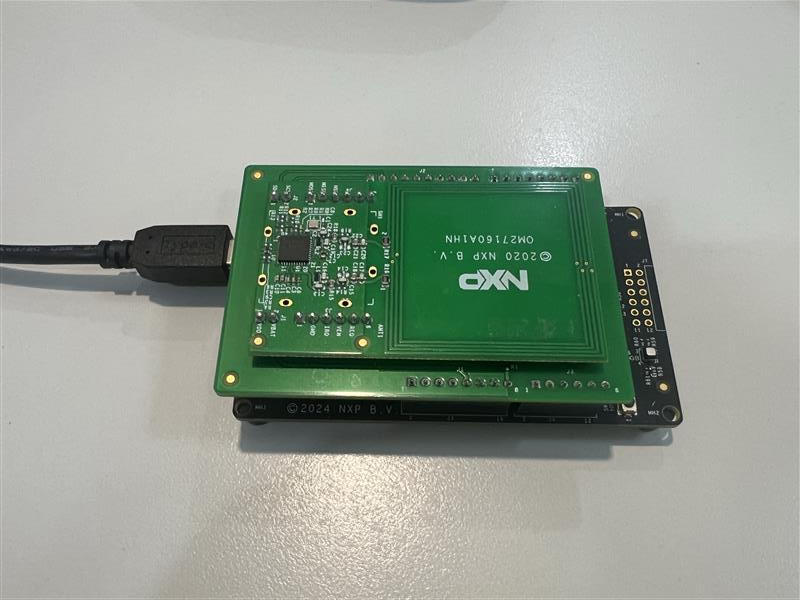
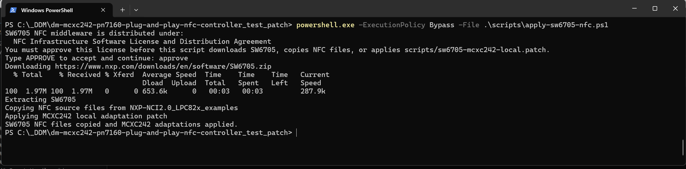
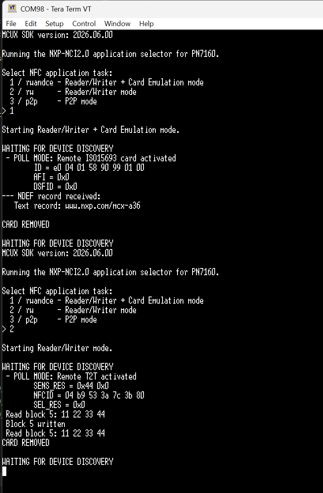

# NXP Application Code Hub
[](https://www.nxp.com)

[中文版](readme_chs.md)

## FRDM-MCXC242 NFC Controller Enablement Using PN7160
*This demo showcases the FRDM-MCXC242 board interfacing with the PN7160 NFC controller through the NXP-NCI 2.0 middleware.*

1. RWandCE - Reader/Writer plus Type 4 Tag Card Emulation mode
2. RW      - Reader/Writer mode
3. P2P     - Peer-to-Peer mode



[Overview]

- MCU board: FRDM-MCXC242 with NXP MCXC242.
- NFC controller: PN7160.
- Host interface: I2C1 at 100 kHz, 7-bit address 0x28.
- PN7160 control pins:
  - SCL: PTD7, I2C1 SCL
  - SDA: PTD6, I2C1 SDA
  - IRQ: PTE31, active-high data-ready interrupt input
  - VEN: PTC8, PN7160 enable/reset output
  - REQ: PTC9, held low for normal NCI boot mode
- Debug console: board debug UART, 115200 8n1.

[Features]
- MCU: NXP MCXC242 on FRDM-MCXC242.
- NFC controller: PN7160.
- Host interface: I2C1, 7-bit address `0x28`, 100 kHz.
- NFC examples: RWandCE, RW, and P2P selectable from the serial console.
- RWandCE mode: reads NDEF data from NFC tags and exposes a simple Type 4 Tag NDEF message to an external NFC reader.
- Reader/Writer mode: detects NFC tags and runs reader scenarios for supported protocols.
- P2P mode: exchanges the sample NDEF message with a remote NFC peer.
- Debug console output through the board debug UART.

#### Boards: [FRDM-MCXC242](https://www.nxp.com/design/design-center/development-boards-and-designs/FRDM-MCXC242), [OM27160](https://www.nxp.com/design/design-center/development-boards-and-designs/PN7160-EVK)
#### Categories: Industrial, User Interface
#### Peripherals: GPIO, I2C, UART
#### Toolchains: VS Code

## Table of Contents
1. [Software](#step1)
2. [Hardware](#step2)
3. [Setup](#step3)
4. [Results](#step4)
5. [Release Notes](#step5)

## 1. Software<a name="step1"></a>
- [MCUXpresso for Visual Studio Code](https://www.nxp.com/design/design-center/software/development-software/mcuxpresso-software-and-tools-/mcuxpresso-for-visual-studio-code:MCUXPRESSO-VSC)
- [SDK_26.06.0_FRDM-MCXC242](https://mcuxpresso.nxp.com/en/welcome)
- MCUXpresso for Visual Studio Code: This example supports MCUXpresso for Visual Studio Code, for more information about how to use Visual Studio Code please refer [here](https://www.nxp.com/design/training/getting-started-with-mcuxpresso-for-visual-studio-code:TIP-GETTING-STARTED-WITH-MCUXPRESSO-FOR-VS-CODE).

## 2. Hardware<a name="step2"></a>
- 1x Type-C USB cable
- 1x OM27160 board
- 1x FRDM-MCXC242 board:



## 3. Setup<a name="step3"></a>

### 3.1 Hardware connection
*Connect the FRDM-MCXC242 to the OM27160 via the FRDM interface, as shown in the figure below.*





### 3.2 Refresh NFC middleware from SW6705

Run the following command from the project root when the NFC middleware and example source files need to be refreshed from NXP SW6705:

```powershell
powershell.exe -ExecutionPolicy Bypass -File .\scripts\apply-sw6705-nfc.ps1
```

The script prompts for approval of the NFC Infrastructure Software License and Distribution Agreement before downloading, copying, or patching any NFC files. Type `APPROVE` at the prompt to continue. If the license is not approved, the script exits without downloading SW6705, copying files, or applying the patch.

For non-interactive use, pass the explicit approval switch:

```powershell
powershell.exe -ExecutionPolicy Bypass -File .\scripts\apply-sw6705-nfc.ps1 -AcceptNfcInfrastructureLicense
```

After approval, the script downloads `https://www.nxp.com/downloads/en/software/SW6705.zip`, copies the mapped NFC source files into this project, and applies the local MCXC242/PN7160 adaptation patch from `scripts/sw6705-mcxc242-local.patch`. The patch file also contains a license notice and must only be applied after approving the NFC Infrastructure Software License and Distribution Agreement.



### 3.3 Download MCXC242 firmware

1. Install MCUXpresso for VS Code from the Visual Studio Code Marketplace.

2. Use a Type-C USB cable to connect the onboard MCU-Link connector (J9) to a USB port on the PC.
   
3. Open Visual Studio Code and verify that the SDK package for the target MCU is installed. If not, install or import the required SDK package.

4. Open Visual Studio Code, in the Quick Start Panel, choose **Import from Application Code Hub**

5. Enter the **demo name** in the **Search...** bar.

6. Configure project **Name** and project path **Location** Click **Import Project(s)**, VS Code will automatically download the project.

> User must to install the [SDK_26.06.00_FRDM-MCXC242](https://mcuxpresso.nxp.com/en/welcome) in MCUXpresso for Visual Studio Code before importing the project.
> 
7. Click **Build Project** to compile this project and then click **Debug** to download the program into FRDM-MCXC242 board.

### 3.4 Test the PN7160 Functionality

1. Connect FRDM-MCXC242's MCU-Link with PC(through J9), Open a Serial Terminal, Select the correct virtual COM (VCOM) port and set 1152008n1.
2. Press the SW1 reset button on the FRDM-MCXC242 to start the PN7160 demonstration application.
3. After reset, the debug UART prints a mode selector:

```text
Select NFC application task:
  1 / rwandce - Reader/Writer + Card Emulation mode
  2 / rw      - Reader/Writer mode
  3 / p2p     - P2P mode
>
```

Enter one of the supported commands and press Enter:

| Command | Mode |
| --- | --- |
| `1`, `rwandce`, or `rwce` | Reader/Writer plus Card Emulation mode |
| `2` or `rw` | Reader/Writer mode |
| `3` or `p2p` | P2P mode |

The selected mode is then initialized and enters its NFC discovery loop. Reset the board to return to the selector and choose a different mode.

## 4. Results<a name="step4"></a>
The terminal output is shown in the figure below.



#### Project Metadata

<!----- Boards ----->
[]()

<!----- Categories ----->
[](https://mcuxpresso.nxp.com/appcodehub?category=industrial)
[](https://mcuxpresso.nxp.com/appcodehub?category=ui)

<!----- Peripherals ----->
[](https://mcuxpresso.nxp.com/appcodehub?peripheral=gpio)
[](https://mcuxpresso.nxp.com/appcodehub?peripheral=i2c)
[](https://mcuxpresso.nxp.com/appcodehub?peripheral=uart)

<!----- Toolchains ----->
[](https://mcuxpresso.nxp.com/appcodehub?toolchain=vscode)

Questions regarding the content/correctness of this example can be entered as Issues within this GitHub repository.

>**Warning**: For more general technical questions regarding NXP Microcontrollers and the difference in expected functionality, enter your questions on the [NXP Community Forum](https://community.nxp.com/)

[](https://www.youtube.com/NXP_Semiconductors)
[](https://www.linkedin.com/company/nxp-semiconductors)
[](https://www.facebook.com/nxpsemi/)
[](https://x.com/NXP)

## 5. Release Notes<a name="step5"></a>
| Version | Description / Update                           | Date                        |
|:-------:|------------------------------------------------|----------------------------:|
| 1.0     | Initial release on Application Code Hub        | July 31<sup>th</sup> 2026 |

<small> <b>Trademarks and Service Marks</b>: There are a number of proprietary logos, service marks, trademarks, slogans and product designations ("Marks") found on this Site. By making the Marks available on this Site, NXP is not granting you a license to use them in any fashion. Access to this Site does not confer upon you any license to the Marks under any of NXP or any third party's intellectual property rights. While NXP encourages others to link to our URL, no NXP trademark or service mark may be used as a hyperlink without NXP’s prior written permission. The following Marks are the property of NXP. This list is not comprehensive; the absence of a Mark from the list does not constitute a waiver of intellectual property rights established by NXP in a Mark. </small> <br> <small> NXP, the NXP logo, NXP SECURE CONNECTIONS FOR A SMARTER WORLD, Airfast, Altivec, ByLink, CodeWarrior, ColdFire, ColdFire+, CoolFlux, CoolFlux DSP, DESFire, EdgeLock, EdgeScale, EdgeVerse, elQ, Embrace, Freescale, GreenChip, HITAG, ICODE and I-CODE, Immersiv3D, I2C-bus logo , JCOP, Kinetis, Layerscape, MagniV, Mantis, MCCI, MIFARE, MIFARE Classic, MIFARE FleX, MIFARE4Mobile, MIFARE Plus, MIFARE Ultralight, MiGLO, MOBILEGT, NTAG, PEG, Plus X, POR, PowerQUICC, Processor Expert, QorIQ, QorIQ Qonverge, RoadLink wordmark and logo, SafeAssure, SafeAssure logo , SmartLX, SmartMX, StarCore, Symphony, Tower, TriMedia, Trimension, UCODE, VortiQa, Vybrid are trademarks of NXP B.V. All other product or service names are the property of their respective owners. © 2021 NXP B.V. </small>